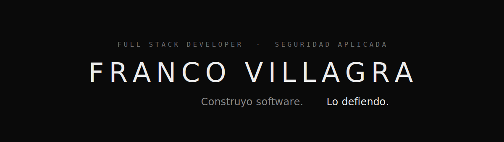

  

---

## 🧑‍💻 Sobre mí

Soy Desarrollador Full Stack: construyo aplicaciones web aplicando ciberseguridad desde el diseño. Expongo vulnerabilidades construyendo herramientas ofensivas, para neutralizarlas. Combino desarrollo en TypeScript/Next.js y Python/FastAPI con seguridad a lo largo de todo el ciclo de vida del software (SDLC).

Actualmente estudio la Licenciatura en Ciberdefensa (FADENA), con base sólida en Desarrollo Full Stack (UTN). Todos mis proyectos están desplegados en producción, construidos con estándares profesionales de seguridad.

---

## 🧰 Stack Tecnológico

**Frontend**

**Backend**

**Seguridad**

**Bases de Datos**

**DevOps & Infraestructura**

---

## 📌 Proyectos Destacados

### 🛰️ Recon Scope

Plataforma de reconocimiento automatizado para auditorías de seguridad autorizadas. Enumera subdominios, escanea puertos e identifica tecnologías — con verificación de propiedad de dominio obligatoria antes de cada scan.

`FastAPI` `Python` `Next.js` `PostgreSQL` `Railway`

---

### 🔍 Log-Sentinel

SIEM liviano de Blue Team que ingiere logs, detecta patrones de ataque en tiempo real mediante reglas personalizadas y transmite alertas a un dashboard en vivo vía WebSocket.

`FastAPI` `Python` `Redis Streams` `Next.js` `WebSockets` `PostgreSQL`

---

### 🔐 Authentication & Authorization API

API REST endurecida para producción con JWT (access de 15 min / refresh de 7 días), RBAC, rate limiting con Upstash Redis, bcrypt, validación con Zod y logging con Winston.

`Next.js` `TypeScript` `JWT` `bcrypt` `Redis` `Prisma`

---

### 🛡️ Web Vulnerability Scanner

Escáner de vulnerabilidades web que detecta security headers faltantes, SSL inválido, cookies inseguras, vectores de XSS y exposición a SQL injection. Stateless, con un dashboard de resultados limpio.

`Next.js` `TypeScript` `Zod` `Recharts`

---

## 🎓 Certificaciones y Formación

| Estado | Certificación |
|:------:|:--------------|
| 🚩 En curso | Licenciatura en Ciberdefensa — FADENA |
| 🎯 Próxima | AWS Certified Cloud Practitioner |
| 📘 Planeada | CompTIA Security+ |
| 📘 Planeada | CEH (Certified Ethical Hacker) |
| 🏆 Objetivo | OSCP (Offensive Security Certified Professional) |

---

## 📬 Conectemos

Estoy siempre abierto a colaborar, escuchar ideas y nuevas oportunidades.

 

