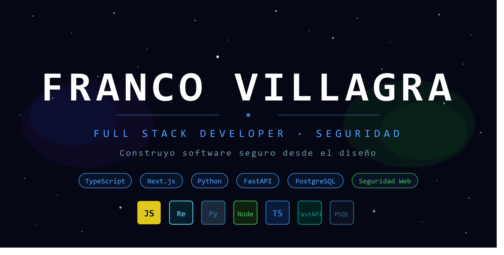

# ¡Hola! 👋

### Soy **Franco Villagra**, Desarrollador Full Stack con formación en Ciberdefensa.

### Construyo productos web con TypeScript/Next.js y herramientas de seguridad con Python.

### Me interesa construir software seguro desde el diseño — desde APIs endurecidas hasta plataformas de análisis ofensivo y defensivo.

### Te invito a explorar mis proyectos. Si querés charlar, contarme una idea o colaborar, escribime.

 

## 🚀 Stack Tecnológico

### Desarrollo Web

### Backend & Seguridad

### Bases de Datos

### Infraestructura

 

## 📌 Proyectos Destacados

### 🛰️ recon-scope
Plataforma de reconocimiento automatizado para auditorías de seguridad autorizadas. Enumera subdominios, escanea puertos y detecta tecnologías, con verificación de propiedad de dominio obligatoria antes de cada scan.

`FastAPI` · `Python` · `Next.js` · `PostgreSQL`

 

---

### 🛡️ web-vulnerability-scanner
Scanner de vulnerabilidades web que detecta SSL inválido, security headers faltantes, cookies inseguras, XSS y SQLi. Dashboard con historial de análisis.

`Next.js` · `TypeScript` · `Zod` · `Recharts`

 

---

### 🔐 auth-api-security
API REST endurecida con JWT, refresh tokens, rate limiting, security headers, bcrypt y validación con Zod.

`Node.js` · `Express` · `JWT` · `bcrypt`

 

 

## 📫 Contacto

