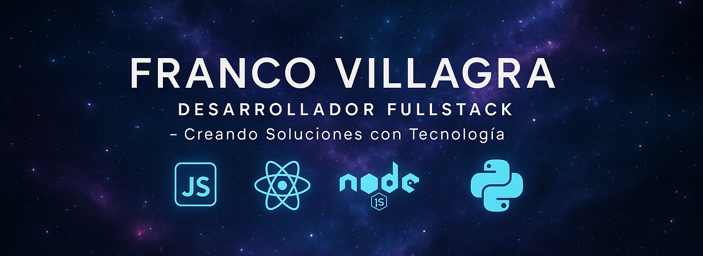

<!-- Banner personalizado -->

  

---

# ¡Hola! 👋 

Soy **Franco Villagra**, un **Desarrollador Fullstack** enfocado en construir soluciones tecnológicas eficientes y escalables.  
Me motiva el aprendizaje continuo resolviendo problemas reales, con compromiso y dedicación.

Te invito a explorar mis proyectos, donde aplico tecnologías modernas para crear software de impacto.
Si querés charlar, colaborar o simplemente contarme alguna idea, no dudes en contactarme.

---

## 📬 Contacto

  
  
  
  
  

## 🚀 Stack Tecnológico

### Frontend

### Backend

### Base de Datos

### Data Science

---

## 🛠 Lenguajes más utilizados

  

---

## 📌 Proyectos Destacados

| Proyecto        | Descripción                           | Tecnologías                    | Enlace                 |
|-----------------|---------------------------------------|--------------------------------|------------------------|
| SomosEquipo     |API RESTful para gestión de tareas colaborativas en español. Permite crear, listar, actualizar y eliminar tareas con persistencia local. Ideal para aprender fullstack y conectar con frontends.    

---

